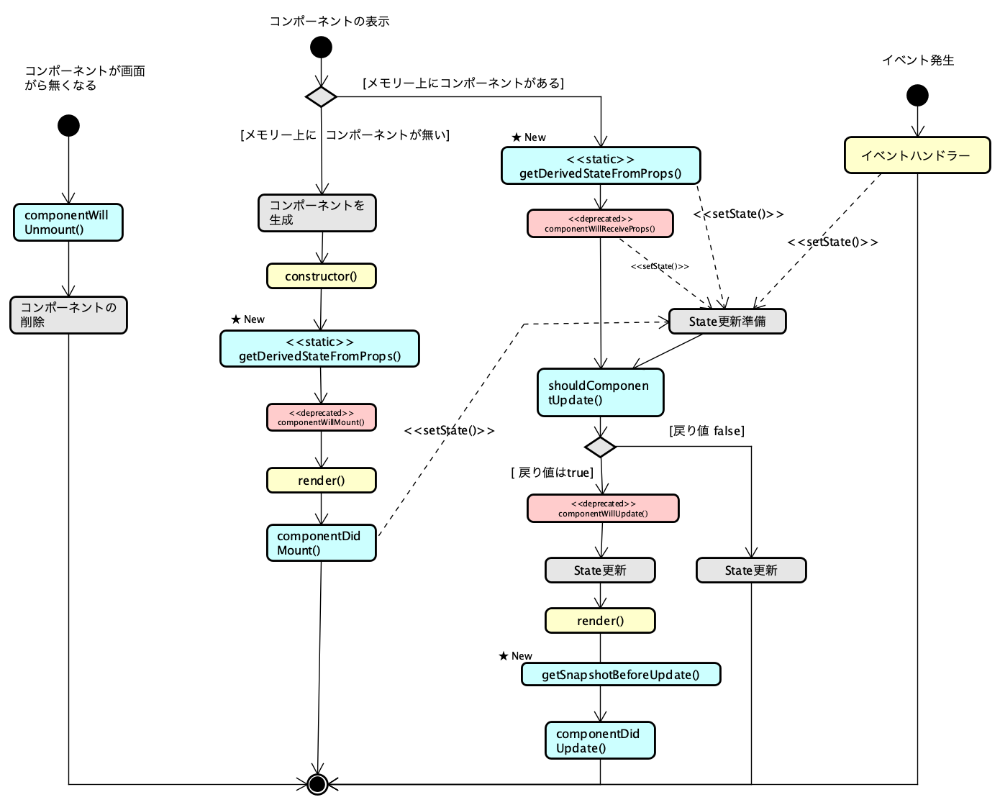
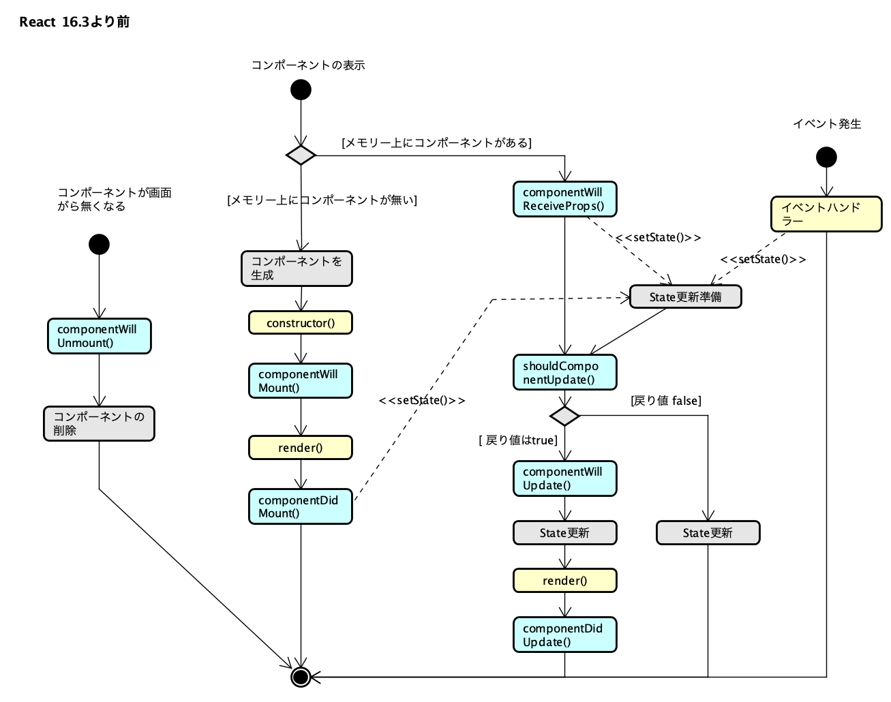

# ライフサイクルメソッドの変更

React 16.3 でライフサイクルメソッド (Lifecycle Methods) の一部が変更になりました。  
とくに、以下のメソッドが無くなりました。

* componentWillMount()
* componentWillUpdate()
* componentWillReceiveProps()

現在リリースされている React 16.X では deprecated Warnig が表示されますが動作しますが、React 17 以降では削除されます。

ただし、React 17 以降でも UNSAFE_componentWillMount() , UNSAFE_componentWillUpdate() , UNSAFE_componentWillReceiveProps() という名前に変更され残りますが新規に作成されるコードでは、新しく追加されたメソッドを使うようにして下さい。

| deprecatedメソッド | 対応メソッド |
|---|---|
| componentWillMount() | 無し、constructor を利用する |
| componentWillUpdate() | getSnapshotBeforeUpdate() |
| componentWillReceiveProps() | getDerivedStateFromProps() |

componentWillReceiveProps() は良く使われるライフサイクルメソッドでしたが、対応する getDerivedStateFromProps() メソッドは componentWillReceiveProps()とは仕様が大きく違います。

1. componentWillReceiveProps()と違い更新時だけでなく、マウント時にも呼ばれます
2. staticメソッドなのでコンポーネントのインスタンス変数にアクセス出来ませんので工夫が必要になります
3. 引数はパラメータ(props)と現在のステータス(state)です
4. 戻り値は、新しいステータスです。ステータスを変更しない場合は null を戻します

## ライフサイクルのアクティビティー図

* React 16.3以降

* React 16.3より前

